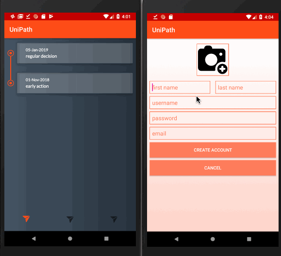

# UniPath

## Description
The purpose of this app is to assist students and parents with finding and applying to colleges. 

## Core user stories
- See list of colleges
- See list of colleges saved to favorites
- See detailed college information
- Calendar that shows deadlines taken from list of favorites (color code?)
- When user favorites a college, deadlines for that college get added to a calendar
- Financial aid: (e.g estimated cost, FAFSA, waiver fees)
- Push notifications - Reminders for deadlines
- Notification center
- Account settings - how often notified, how many days before deadline, default settings, etc.
- Search/Filtering: cost of college, size of college you're looking for, location, acceptance rate, major, average GPA/SAT, happiness of students, etc.
- Map based search (List view vs Map view)
- notify if finished applications

## Optional user stores
- Log in as either college admissions representative or general
- Map of saved colleges
- Showing colleges on map based on criteria (places that offer testing
- Financial aid calculator that is specific to each college
- Push notifications - Reminders to parents for deadlines (text message/email)
- Suggestions to succeed while in high school? (AP classes, leadership opportunities, volunteering)
- More detailed information about campus life/majors/classes (link to website?)
- track how many people favorited college (?)
- feed page/reviews
- after accepted what to do

## Walkthrough week 1 progress

